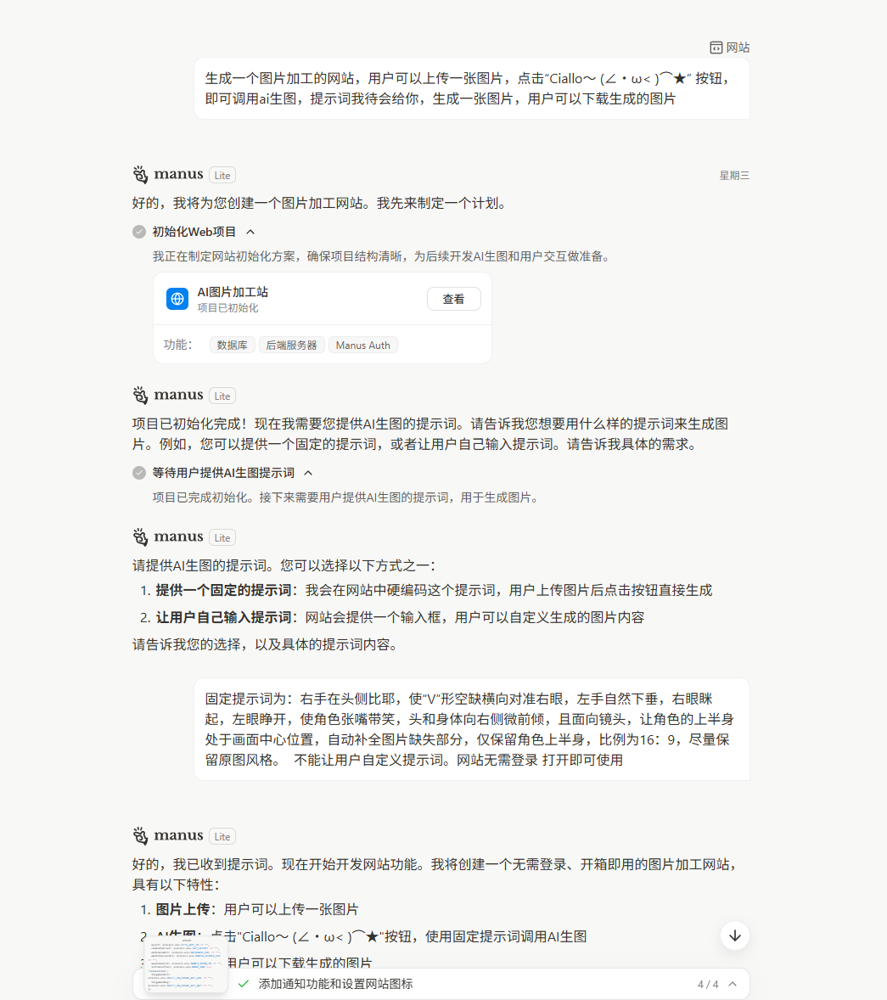
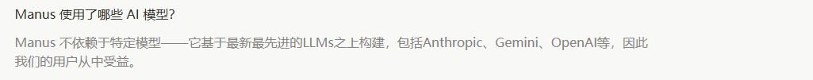

# Manus免费1万亿Token活动


最近了解到manus搞了个免费万亿Token活动，在他们平台上面生成的网站中使用AI完全免费，于是注册了一个账号生成一个网站试试水~


[Manus | 免费提供1万亿AI代币，用于构建Web应用](https://manus.im/zh-cn/campaign/free-tokens)


# Ciallo图片生成器


## 网站生成过程与效果


从群里了解到一个AI生成Ciallo图片的提示词：


```markdown
右手在头侧比耶，使\"V\"形空缺横向对准右眼，左手自然下垂，右眼眯起，左眼睁开，使角色张嘴带笑，头和身体向右侧微前倾，且面向镜头，让角色的上半身处于画面中心位置，自动补全图片缺失部分，仅保留角色上半身，比例为16：9
```


于是试试水~





网站生成回放地址：[https://manus.im/share/5yA934nikEkxDPeiXZ1ey8?replay=1](https://manus.im/share/5yA934nikEkxDPeiXZ1ey8?replay=1)


生成的效果：


网站体验地址：[https://aiprocessor-tnrzdzto.manus.space](https://aiprocessor-tnrzdzto.manus.space/)


图片生成的质量还行，看官方说明貌似是使用了各种模型，我实际体验下来明显的有用豆包，因为有水印，其他的暂时不清楚。





## 网站流量


网站上线后中午在Q群推广了一波，没想到下午三点开始直接起飞~


后面跌下来是因为请求量太大Manus给我的api限速了，导致没人能用了。


# 总结


**Manus AI的这套网站生成包括了一整套前后端全栈，还有对象存储、数据库、AI服务、无服务部署的集成一整套，甚至还预留了一些第三方如Strip的对接方法，基本上属于门槛极低的开发方式了。**


但是无法导出的项目，以及AI的API请求数过高就会限速，对于一些突然爆火的产品可能是致命的打击（可能因为是免费的AI Token所以限速）。


这个非常搞一些小玩意还是不错，商业化有点困难，自定义程度不够高。

