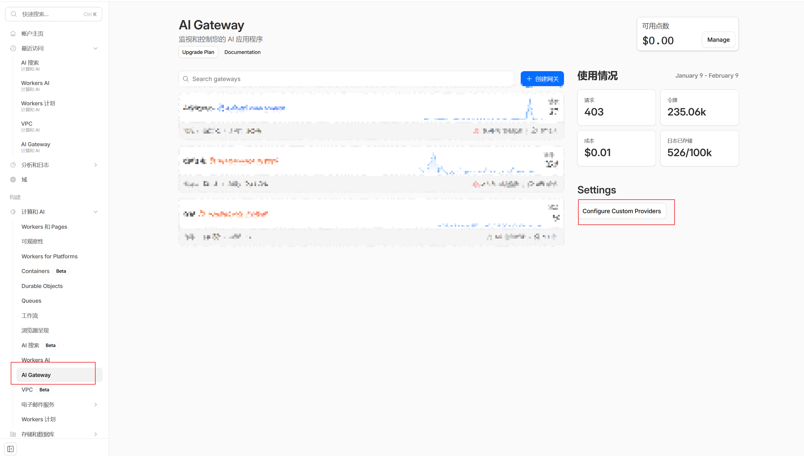
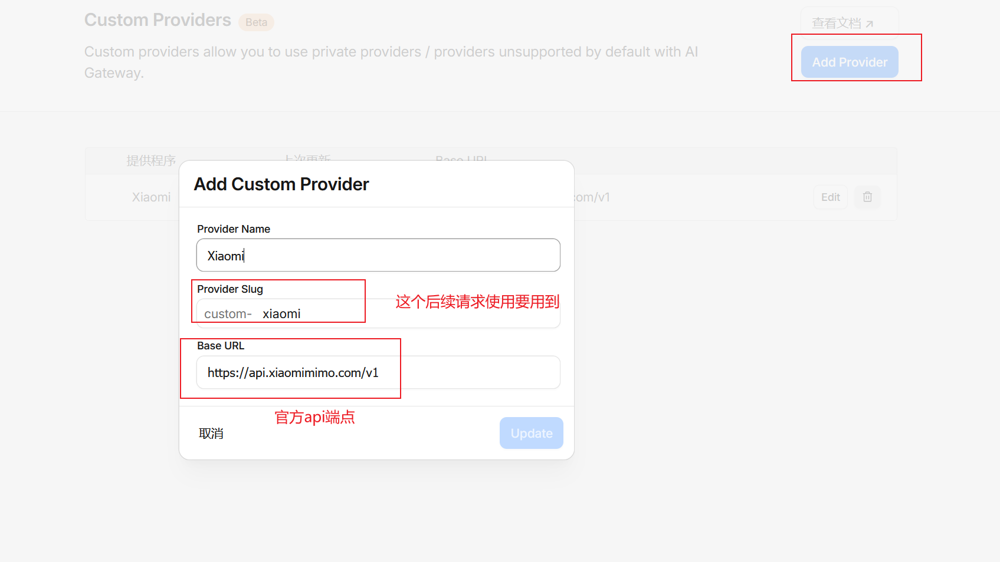

### Cloudflare AI Gateway 自定义供应商配置与踩坑记录


这篇记录我们在 Ankigenix 项目里接入 Cloudflare AI Gateway（自定义供应商）时的配置方式和几个容易踩的坑，方便之后复盘或给团队/社区做参考。


### 背景与目标


我们希望把 AI 请求统一走 Cloudflare AI Gateway，以获得：

- 统一的流量观测与计费追踪
- 更清晰的请求统计与排查路径
- 未来替换供应商时更少改动

同时我们使用的是 **自定义供应商**（例如小米 MiMo），不是 Cloudflare 内置供应商。


### Cloudflare上自定义AI网关供应商


1.打开自定义ai供应商





2.添加自定义供应商，注意记住这个slug





### 网关请求结构（核心结论）


AI Gateway 并不替你“代管供应商鉴权”。即使你在 Cloudflare 控制台里配置了供应商与 key，**请求仍然需要带供应商 API Key**。


常见请求结构（以 OpenAI SDK 兼容接口为例）：

- `Authorization: Bearer <供应商 API Key>`
- `cf-aig-authorization: Bearer <CF_AIG_TOKEN>`（如果开启网关鉴权）

也就是说：**网关 token 不是供应商 key 的替代品**。


### baseURL 格式要点


自定义供应商场景，`baseURL` 通常需要带 `/v1`：


```plain text
https://gateway.ai.cloudflare.com/v1/<account>/<gateway>/<provider>/v1
```


举例：


```plain text
https://gateway.ai.cloudflare.com/v1/ACCOUNT/GATEWAY/custom-xiaomi/v1
```


SDK 会自动拼接 `chat/completions`，所以 baseURL 末尾的 `/v1` 很关键。


### OpenAI SDK 配置（推荐）


把网关配置放进环境变量，启动时判断是否启用：


```typescript
import OpenAI from "openai";

const client = new OpenAI({
	apiKey: process.env.MIMO_API_KEY, // 供应商 key
	baseURL: process.env.CF_AIG_BASE_URL,
	defaultHeaders: {
		"cf-aig-authorization": `Bearer ${process.env.CF_AIG_TOKEN}`,
	},
});
```


如果没有配置 `CF_AIG_BASE_URL` 或 `CF_AIG_TOKEN`，则回退到直连供应商 API。


### 一条可用的 curl 参考


（用占位符代替真实密钥）


```bash
curl https://gateway.ai.cloudflare.com/v1/<account>/<gateway>/<custom-provider-slug>/v1/chat/completions \
	--header 'cf-aig-authorization: Bearer <CF_AIG_TOKEN>' \
	--header 'Authorization: Bearer <PROVIDER_API_KEY>' \
	--header 'Content-Type: application/json' \
	--data '{"model": "mimo-v2-flash", "messages": [{"role": "user", "content": "Hello"}]}'
```


### 踩坑记录

1. **401：只带 CF token，没带供应商 key**
    - 这是最容易误判的点。
    - CF token 只认证网关访问权限。
2. **baseURL 少了** **`/v1`**
    - SDK 会自动拼路径。
    - 漏了 `/v1` 可能直接 404 或 401。
3. **PM2 环境没更新**
    - 改了 env 后记得：`pm2 restart <name> --update-env`。
4. **模型名和 provider 组合不匹配**
    - 自定义供应商通常用原模型名（例如 `mimo-v2-flash`）。
    - 不同 gateway 路由规则可能不同，记得和 Cloudflare 控制台配置对齐。

### 最终配置建议

- 用环境变量统一控制：
    - `CF_AIG_BASE_URL`
    - `CF_AIG_TOKEN`
    - `OPENAI_API_KEY` / `MIMO_API_KEY` / `DEEPSEEK_API_KEY`
- 只有同时配置 `CF_AIG_BASE_URL` 和 `CF_AIG_TOKEN` 才走网关。
- 网关模式下，**仍然必须传供应商 API Key，否则用不了。**

### 小结


Cloudflare AI Gateway 是一个很好的“观测和路由”层，但它不会替你完成供应商鉴权。


对自定义供应商尤其如此：**网关 token + 供应商 token 必须同时存在**。


把这些约束写入项目配置和部署脚本里，才能真正做到稳定、可复用。

