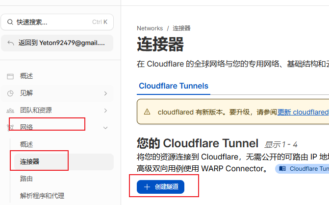
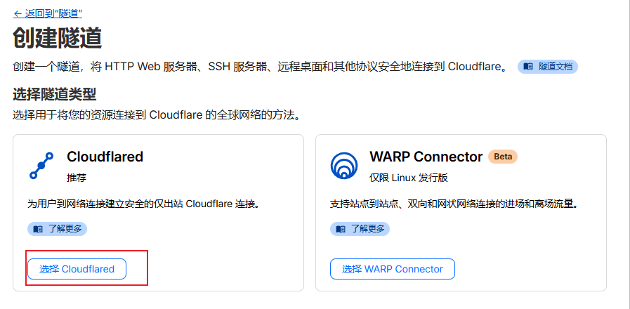
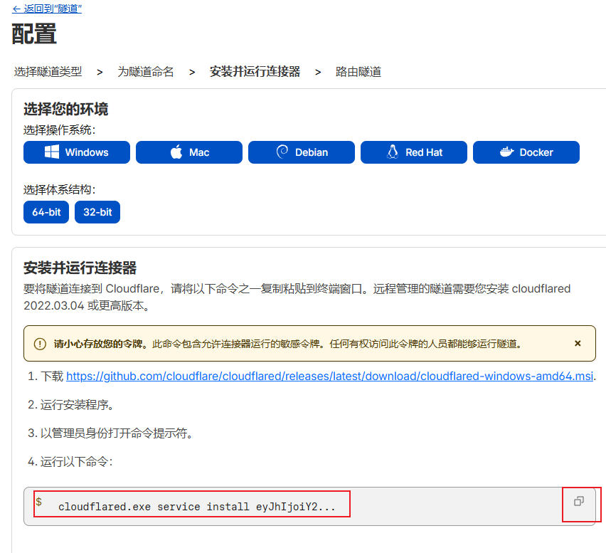
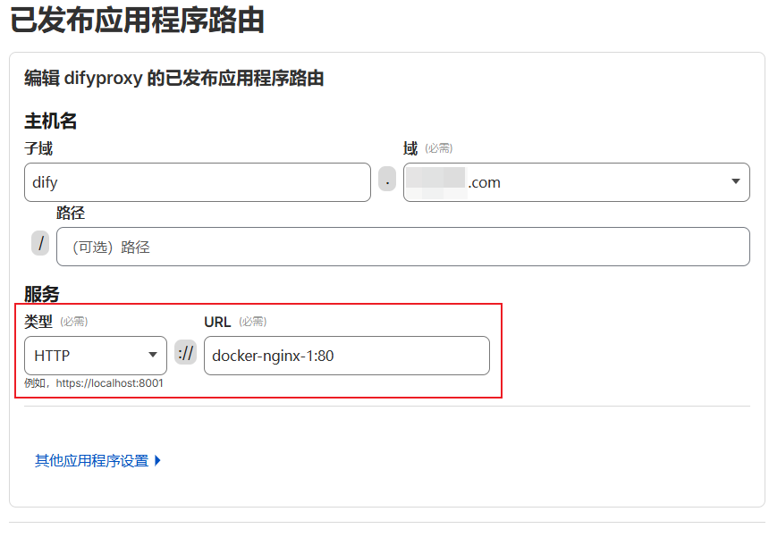

### 1. 核心原理

Cloudflare Tunnel 通过本地 `cloudflared` 进程建立 **出站（Outbound）** 连接。由于不占用服务器入站端口（80/443），可以有效绕过国内运营商对未备案域名的 SNI 拦截。

### 2. 准备工作

- **服务器**：国内云服务器（已安装 Docker）。
- **域名**：已托管至 Cloudflare。
- **权限**：开通 Cloudflare Zero Trust 访问权限。

### 3. 部署步骤

### A. 获取 Token

在 Cloudflare Zero Trust 控制台依次点击 `网络` -> `连接器` -> `创建隧道`。

选择claudeflared类型

在安装和部署页面选择 Docker，复制环境变量 `TUNNEL_TOKEN` 后面的长字符串（需要先复制出来手动提取这个token）。

### B. 容器化部署

利用 Docker 将隧道接入应用所在的内部网络（以 Dify 常用网络名为例）这里的`<YOUR_TOKEN>` 填你的token：

Bash

`docker run -d \
  --name cf-tunnel \
  --network docker_default \
  --restart always \
  cloudflare/cloudflared:latest \
  tunnel --no-autoupdate run --token <YOUR_TOKEN>`

### C. 后台映射配置

在控制台 **`已发布应用程序路由`** 页面添加记录：

- **Hostname**: [`sub.yourdomain.com`](http://sub.yourdomain.com/)
- **Service Type**: `HTTP`
- **URL**: `docker-nginx-1:80`（此处填入 Dify 或应用容器的 Name 及内部端口）

然后可以通过域名访问你的服务了！

### 4. 优化与安全策略

- **关闭公网端口**：在云服务商安全组（防火墙）中 **完全关闭 80、443 端口**。此时流量仅走内部隧道，公网 IP 不暴露 Web 特征。
- **SSL 模式**：由于服务器无证书，Cloudflare Dashboard 的 SSL/TLS 建议设置为 `Flexible`。
- **大文件上传**：若需上传大文件（如 Dify 知识库），需在 CF 规则中调整 `Client Max Body Size` 限制。

可以配合优选节点在国内获得更快访问速度： [Cloud Flare配置优选节点教程 - 潮思Chaosyn](https://blog.chaosyn.com/posts/cloud-flare%E9%85%8D%E7%BD%AE%E4%BC%98%E9%80%89%E8%8A%82%E7%82%B9%E6%95%99%E7%A8%8B/)

