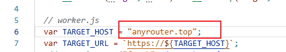
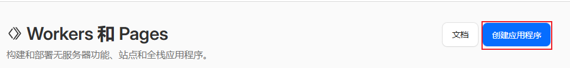
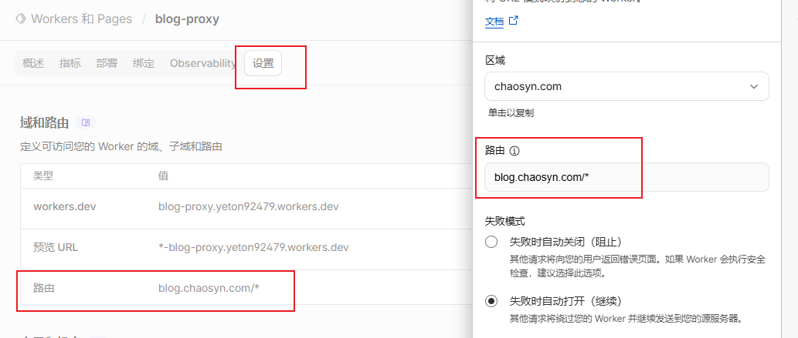
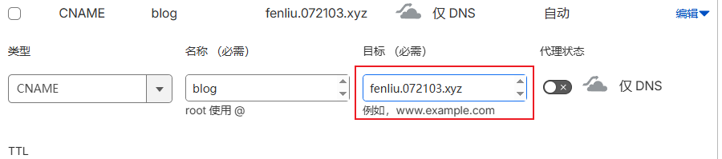
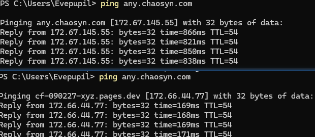

Vercel部署的项目在国内有些网络确实访问很慢，有时也和Vercel抽风有关。但是我们可以使用CF反代+优选节点，来达到国内访问加速的目的。

准备：

1. 要反代的Vercel项目，以及对应的域名
2. CF账号

注意：**后续假设要加速访问（用户要访问的）的域名为B.xxx.com，Vercel当前绑定域名为A.xxx.com（此域名是未加速的）**

## Cloud flare反代

之前已经有文章讲过怎么做了：[Cloudflare Worker反向代理网站教程 - 潮思Chaosyn](https://blog.chaosyn.com/posts/cloudflare-worker%E5%8F%8D%E5%90%91%E4%BB%A3%E7%90%86%E7%BD%91%E7%AB%99%E6%95%99%E7%A8%8B/)

最简单的操作步骤：

1. Fork或自己实现反代脚本，仓库在：[https://github.com/evepupil/any-proxy](https://github.com/evepupil/any-proxy)
2. 记得把反代的域名换成你想反代的网站。这里反代vercel的项目，需要你在vercel的项目绑定域名A.xxx.com，在这里绑定。

1. cloud flare上面创建应用程序，选择Fork的仓库

1. 等待部署成功
2. 拦截路由，CF worker设置界面添加一个路由，使其拦截B.xxx.com的所有路由请求，这样只要是经过这个域名的请求，都会通过此worker进行代理。

## Cloud flare优选节点

之前已经有文章讲过怎么做了：[https://blog.chaosyn.com/posts/cloud-flare配置优选节点教程/](https://blog.chaosyn.com/posts/cloud-flare%E9%85%8D%E7%BD%AE%E4%BC%98%E9%80%89%E8%8A%82%E7%82%B9%E6%95%99%E7%A8%8B/)

最简单的操作步骤：

1. CF的DNS配置一条CNAME，目标为任意优选节点

1. 完成！现在访问B.xxx.com的速度得到CF优选节点加速，加速效果明显

